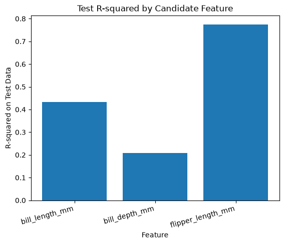
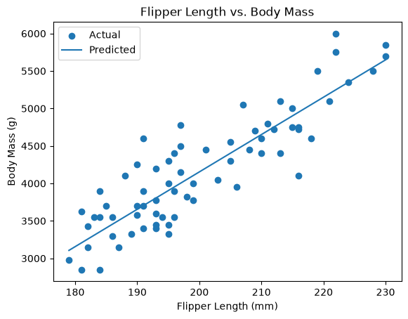
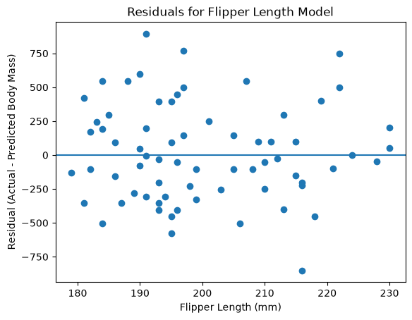

# datafun-06-ml

[](https://denisecase.github.io/pro-analytics-02/workflow-b-apply-example-project/)
[](./pyproject.toml)
[](https://docs.astral.sh/uv/)
[](https://docs.astral.sh/ty/)
[](https://docs.astral.sh/ruff/)
[](https://scikit-learn.org/)
[](https://zensical.org/)
[](./LICENSE)

> Which penguin measurement best predicts body mass? Testing three candidates
> on the same split instead of picking one and hoping.

## The Question

The example project predicts body mass from bill length. That choice is never
tested against the alternatives, and the dataset has three numeric
measurements that could all plausibly work:

- bill length
- bill depth
- flipper length

This project fits all three on the same train/test split, compares them, and
then builds the full model around whichever one wins.

## Results

Flipper length wins by a wide margin.

| Feature | Test R² | Test RMSE |
|---|---|---|
| **flipper_length_mm** | **0.775** | **356.05** |
| bill_length_mm | 0.433 | 565.76 |
| bill_depth_mm | 0.208 | 668.28 |



The example's choice came in second at roughly half the R².

Against a baseline that predicts the training mean for every row
(RMSE 751.68), the flipper length model cuts average error by 53%. The bill
length model only cuts it by 25%.

The learned line:

```text
body_mass_g = 49.851 * flipper_length_mm - 5816.874
```

Each additional millimeter of flipper is worth about 50 grams of body mass.
The intercept of -5817 has no real meaning here, since a penguin with a
zero-length flipper does not exist.



## What The Metrics Did Not Show

The residual plots for the two features behave differently, and only one of
them tells you.



With bill length, the residuals fanned out as bill length increased. They
stayed within about 700 grams around 37mm and spread from -1300 to +1000 by
50mm. That model was unreliable specifically for larger penguins.

With flipper length, the residuals sit in an even band of roughly plus or
minus 750 across the whole range.

Nothing in the bill length model's R² or RMSE flagged that pattern. It was
only visible in the plot.

## Limitation

Gentoo penguins are larger on every measurement in this dataset. Some of the
0.775 may be the model learning which species a penguin is rather than
learning a flipper-to-mass relationship.

In a prior project on this same data I found a pooled correlation of 0.871
drop to 0.468 for Adelie once the species were separated. Fitting one model
per species is the obvious next experiment.

## Method

```text
OBSERVE     344 penguins, 8 columns
DECLARE     target body_mass_g, three candidate features
PREPARE     drop rows missing feature or target (342 remain)
SPLIT       80/20, random_state=42
BASELINE    DummyRegressor, mean strategy
TRAIN       LinearRegression
PREDICT     on X_test (69 rows)
EVALUATE    baseline vs model, RMSE and R-squared
VISUALIZE   feature comparison, predictions, residuals
ASSESS      written interpretation in the log
```

All three candidate features use the same random seed, so they are judged on
identical training and test rows. Comparing them on different splits would
not be a fair test.

## Data

Palmer Penguins, 344 rows, one row per penguin. See
[docs/data-card.md](./docs/data-card.md) for provenance and column
descriptions.

## Skills Demonstrated

- Supervised machine learning with scikit-learn
- Train/test splitting and baseline comparison
- Feature selection by evidence rather than assumption
- Model evaluation with RMSE and R-squared
- Residual analysis and reading what metrics miss
- Charting with matplotlib
- src-layout Python packaging managed with uv
- Ruff formatting and linting, ty type checking
- CI/CD through GitHub Actions with hosted documentation

## Run It Yourself

```shell
git clone https://github.com/jgdavis24/datafun-06-ml
cd datafun-06-ml
code .
```

Then in a VS Code terminal:

```shell
uv sync
uv run python -m datafun.app
```

Three chart windows open. Close all three to let the script finish. A
`project.log` appears in the root folder and the terminal prints:

```shell
===================================
END main() - Executed successfully!
===================================
```

<details>
<summary>Show full command reference</summary>

```shell
uv self update
uv python pin 3.14

uv python install
uv lock --upgrade
uv sync

uv run pre-commit install
uv run pre-commit autoupdate

git add -A
uv run pre-commit run --all-files
# repeat if changes were made by pre-commit tasks
git add -A
uv run pre-commit run --all-files

# run the project
uv run python -m datafun.app

# do chores
uv run ruff format .
uv run ruff check . --fix
uv run ty check
uv run python -m pytest
uv run python -m zensical build

# save progress as you work
git add -A
git commit -m "your message here"
# repeat if changes were made (try the UP ARROW)
git add -A
git commit -m "your message here"

git push -u origin main
```

</details>

## Notes on Tooling

Run **both** ruff commands before pushing. `ruff format` and `ruff check` are
different tools and passing one does not mean passing the other.

If VS Code does not use the project's `.venv`, open the Command Palette
(`Ctrl+Shift+P`) and run **Python: Select Interpreter**, then pick the
interpreter from this project's `.venv` folder.

## Documentation

- [Documentation](https://jgdavis24.github.io/datafun-06-ml/)

## Data Card

- [Palmer Penguins Data Card](./docs/data-card.md)

## Citation

- [CITATION.cff](./CITATION.cff)

## License

This project is licensed under the [MIT License](./LICENSE).
